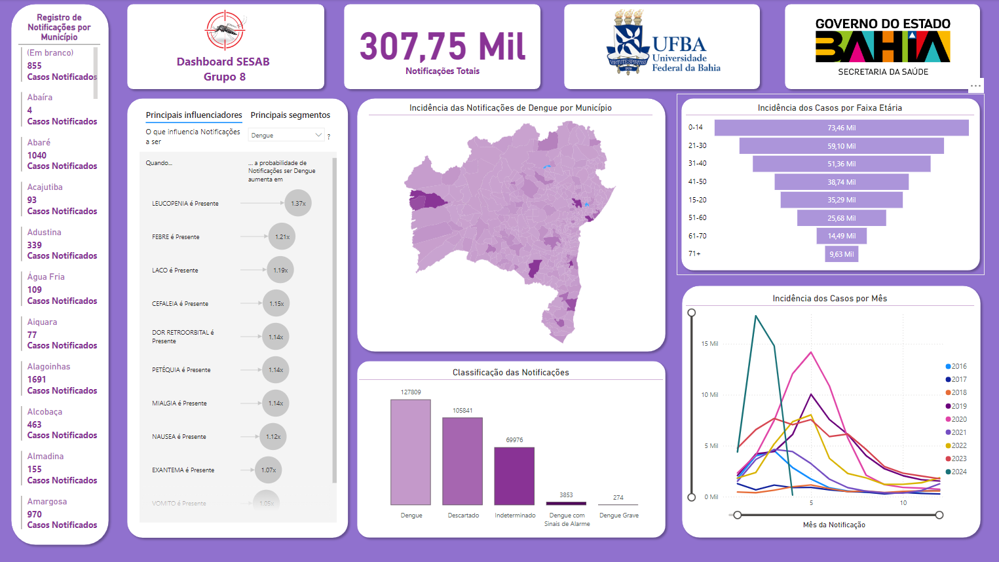

### This READ.md template was written based on this [repository](https://github.com/FernandoSchett/github_readme_template).

<div align="center" style="line-height: 0.5">

# Relatórios - SESAB

</div>

<table style="border: none;">
  <tr>
    <td align="left" style="padding-right: 90px; border: none;">
      <a href="link_for_website">
        
      </a>
    </td>
    <td align="right" style="padding-left: 90px; border: none;">
      <a href="link_for_website">
        
      </a>
    </td>
  </tr>
</table>


<div align="center">

## Integrantes do Grupo:
Adrielly Silva Ferreira de Oliveira,
Danilo Oliveira Andrade,
Diego Quadros dos Santos Dias,
Gabriel Sinzinio Bonfim Cruz,
Guilherme Castro Hora Fontes,
Gustavo Jorge Novaes Silva,
João Victor Leahy de Melo.

</div>

Este relatório contempla uma das entregas que devem ser realizadas para a matéria 

<div align="center">

**ADML - 43: ACCS: Oficina de Projetos em Inteligência Artificial**

</div>

Estes relatórios especificam a criação de um modelo de aprendizado de máquina que, a partir dos dados disponibilizados pela SESAB, deve ser capaz de responder a seguinte pergunta:

<div align="center">

**Este indivíduo foi diagnosticado com dengue com base nos dados disponíveis?**

</div>

**Os relatórios constantes neste documento estão relacionados com as etapas definidas no início do curso, sendo elas:**  

  - **Relatório 1 - Pré-processamento**
  - **Relatório 2 - Algoritmo de Aprendizado de Máquina**
  - **Relatório 3 - Análise dos Resultados**
  - **Relatório 4 - Entrega do modelo**

## Relatório 1 - Pré-processamento e Análise de Dados:

Este relatório contempla todos os procedimentos realizados durante a etapa de pré-processamento, incluindo o desenvolvimento de um Dashboard de visualização dos dados, nos permitindo uma análise detalhada das informações pré-processados. 

### Pré-Processamento:

Para o pré-processamento, utilizamos a linguagem Python e as suas bibliotecas:

- **SEABORN**
- **MATPLOTLIB**
- **SCIKIT-LEARN**
- **NUMPY**
- **PANDAS**

Para o pré-processamento fizemos algumas etapas:

- **Retirada de Dados Ausentes**
Quando fomos analisar os dados, percebemos que haviam muitas colunas com dados faltantes. A ausência desses dados seria prejudicial na elaboração do modelo e por isso resolvemos,incialmente, retirar as colunas que possuem mais de 30% de dados faltantes. Após isso, resolvemos excluir as linhas que possuiam dados faltantes para que elas também não influenciem negativamente os resultados. Após as operações, a tabela continha 307.753 linhas e 52 colunas.As operações realizadas foram as seguintes:

```python
#Retiramos do DataFrame todas as colunas que possuem mais de 30% dos dados ausentes
threshold = len(data) * 0.7
data_cleaned = data.dropna(thresh=threshold, axis=1)

#Removemos todas as linhas que possuem algum dado ausente
data_cleaned = data_cleaned.dropna()
```
- **Seleção das Colunas que Possuem Relevância para Diagnóstico de Dengue**
Mesmo após a remoção das colunas que possuiam quantidades de dados faltantes, ainda tinhamos 52 colunas, que são muitas features para treinamento de modelo e muitas delas com informações desnecessárias para o diagnóstico de dengue, tais como: município de residência, id da notificação e afins. Por isso, optamos por selecionar apenas as colunas que continham informações relevantes para o diagnóstico. Essas colunas são:

```python
columns_to_keep = ['FEBRE', 'MIALGIA', 'CEFALEIA', 'EXANTEMA', 'VOMITO', 'NAUSEA', 
                       'DOR_COSTAS', 'CONJUNTVIT', 'ARTRITE', 'ARTRALGIA', 'PETEQUIA_N', 
                       'LEUCOPENIA', 'LACO', 'DOR_RETRO', 'DIABETES', 'HEMATOLOG', 
                       'HEPATOPAT', 'RENAL', 'HIPERTENSA', 'ACIDO_PEPT', 'AUTO_IMUNE', 
                       'CS_SEXO', 'SG_UF', 'ID_MN_RESI', 'CLASSI_FIN']

# Filtrar o DataFrame para manter apenas as colunas desejadas
data_cleaned = df[columns_to_keep]
```

Não conseguimos enviar a planilha dos dados pré-processados para o repositório do GitHub devido a sua extensão. Por isso os dados não se encontram no repositório, mas se seguirem o código descrito acima, chegarão aos mesmos dados encontrados pelo grupo.

Segue em anexo os histogramas do pré processamento:

<div align="center">
  <table style="border: none; margin: auto; background-color: white;">
    <tr>
      <td align="center" style="border: none;">
        <a href="link_for_website">
          
        </a>
      </td>
    </tr>
  </table>
</div>

Caso a visualização esteja tendo problemas de visualização devido ao modo escuro do GitHub, suegerimos que clique com o botão direito na imagem e escolha abrir a imagem em uma nova guia, onde ela será exibida corretamente.

### Conclusão

Neste relatório, detalhamos os procedimentos de pré-processamento realizados nos dados para garantir a integridade e relevância do conjunto de dados utilizado no diagnóstico de dengue. Utilizando as bibliotecas Python SEABORN, MATPLOTLIB, SCIKIT-LEARN, NUMPY e PANDAS, abordamos a remoção de colunas com mais de 30% de dados ausentes e a exclusão de linhas com valores faltantes, resultando em um dataset final com 307.753 linhas e 52 colunas.

Além disso, selecionamos especificamente as colunas mais relevantes para o diagnóstico de dengue, garantindo features mais pertinentes para as etapas subsequentes de análise e modelagem dos algoritmos de classificação.

### Dashboard de visualização dos dados:

Nesta seção, discutiremos as decisões e ideias que nortearam a construção das três iterações do dashboard requerido para esta entrega. A seguir, abordaremos as versões diferentes do dashboard, cada versão terá detalhadamento acerca das visualizações escolhidas e insights adquiridos a partir da análise dessas visualizações; ademais, iremos anexar em cada seção uma imagem que fornecerá um preview do dashboard como um todo. Entretanto, por se tratar de uma imagem estática, caso desejem uma visualização dinâmica do dashboard, onde permita a manipulação de filtros e dados, basta clicar na imagem, que você será redirecionado para os respectivos dashboards na plataforma PowerBI Online (importante destacar que será necessário o login na conta UFBA para o acesso dessa maneira). Entretanto, para aqueles que preferirem, basta baixar os arquivos das iterações do dashboard, basta clicarem nos links a seguir: [Primeira Iteração](./Dashboard_SESAB_1.pbix), [Segunda Iteração](./Dashboard_SESAB_2.pbix), [Terceira Iteração](./Dashboard_SESAB_3.pbix). Uma vez clicado, basta clicar no ícone superior direito da tela do github onde podemos ver uma seta apontando para baixo. Dessa forma, você poderá baixar o dashboard e acessá-lo pelo aplicativo do PowerBI em seu computador pessoal.

#### Primeira Iteração - 10/06/2024

<div align="center">
  <table style="border: none; margin: auto; background-color: white;">
    <tr>
      <td align="center" style="border: none;">
        <a href="https://app.powerbi.com/links/2qgnVXixyU?ctid=df71f6bb-e3cc-4f5b-b532-79de261b51a2&pbi_source=linkShare">
          
        </a>
      </td>
    </tr>
  </table>
</div>

##### Seleção e Manipulação dos Dados para Visualização:

Importante ressaltar, em primeira instância que na primeira iteração do dashboard, houve um equívoco por parte da equipe. O engano diz respeito à escolha de produzir um dashboard apenas focado em critérios relacionados aos sintomas dos pacientes e as implicações que tais sintomas acarretam nos resultados dos diagnósticos. Dito isso, mantivemos intacto as motivações e explicações utilizadas pela equipe na construção do primeiro relatório do dashboard. A partir da segunda iteração, percebemos que o dashboard deve abrangir as features da base de dados como um todo e, portanto, não haverá essa errata nas seguintes seções. Segue o texto:

Como ressaltado anteriormente, devemos responder à pergunta: Se um dado paciente apresentar *X* sintomas, ele receberá diagnóstico de dengue com base nos dados disponíveis ? 

Diante dessa provocação, optamos por seguir com o pré-processamento da etapa anterior, que já havia selecionado colunas importantes relacionadas ao diagnóstico de dengue. Caso haja alguma dúvida sobre quais features foram escolhidas, basta voltar algumas seções deste documento, que estará tudo explicado. 

Entretanto, acho importante ressaltar algumas decisões adotadas somente para a parte do dashboard com relação aos dados. As principais alterações foram:

- Criação de uma nova coluna (Absolute_Dengue) que agrupa os casos classificados como indeterminados e descartados em um grupo e as classificações de dengue em outro. Isto ajudou na elaboração de uma visualização que funciona de maneira binária na classificação da doença;

- Alteração dos valores do atributo CLASSI_FIN de numéricos para categóricos, para que assim haja uma coesão maior na apresentação do dashboard;

- Alteração das classificações de sexo (gênero) para que também houvesse maior coesão na criação das visualizações;

- Alteração dos valores que determinavam a presença ou ausência de um sintoma, também favorecendo a coesão das visualizções.

Caso haja interesse em saber todas as alterações realizadas, basta baixar a base de dados e clicar na opção de tranformar dados. A plataforma do PowerBi mantém um "track" das alterações feitas na base e é visível para todos os interessados.

##### Escolha das Visualizações:

Nesta seção vamos descrever as visualizações criadas e como elas se relacionam com a pergunta estabelecida para esta etapa/cenário do trabalho. As visualizações estão catalogadas a partir de seus nomes, exceto para os charts:

- *Charts para Informações Gerais*
  - Nesta visualização, temos 4 charts que nos trazem informações gerais , mas pertinentes acerca das notificações de dengue dos dados pré-processados. Onde exibimos: a quantidade de sintomas levados em conta no diagnóstico da doença, a quantidade de casos classificados como dengue, a quantidade de notificações descartadas e também a quantidade de notificações levantadas (descartadas+confirmadas).Importante ressaltar que essas informações são dinâmicas e podem ser alteradas quando escolhermos um certo diagnóstico ou gênero, por exemplo. A visualização desses dados contribiu para um entendimento geral da base de dados e ajuda a situar o observador sobre o dashboard em questão.

- *Gênero dos Notificados*
  - Nesta visualização, podemos visualizar a quantidade de homens, mulheres e pessoas de sexo não definido notificadas. Ao clicarmos em uma das seções do gráfico de pizza, podemos especificar o gênero que queremos explorar os dados e o restante das visualizações será ajustado de acordo com esse filtro. Através desse gráfico, podemos notar a existência ou não de uma tendência de confirmação de casos para algum dos sexos e assim, levantar pesquisas e experimentos para se aprofundar no debate, caso haja suspeitas.

- *Sintomas Mais Presentes nas Notificações*
  - Nesta visualização, podemos visualizar os 5 sintomas mais presentes nas notificações para casos de suspeita de dengue. Importante ressaltar que os valores presentes na visualização se referem tanto para as notificações indeterminadas, descartadas e confirmadas. Para saber a quantidade absoluta para cada uma das classificações, basta selecionar as colunas do gráfico a seguir no dashboard, que assim esses valores serão filtrados e atualizados para corresponder ao filtro do usuário. A escolha da adoção desta visualização situa o observador nos sintomas mais recorrentes que levam à suspeita de dengue, sendo muito útil para o diagnóstico.

- *Classificação das Notificações*
  - Nesta visualização, o gráfico de colunas nos evidencia os diferentes tipos de classificação de casos de dengue e também a recorrência desses casos com os dados pré-processados da base de dados. Essa visualização é fundamental para se entender não só a classificação dos casos mas também para ter em mente sua distribuição de acordo com as categorias estabelecidas, demonstrando a incidência da doença nas notificações registradas.

- *Influenciadores no Diagnóstico de Dengue*
  - Nesta visualização, o PowerBI oferece uma ferramenta que calcula a influência de certas features para uma certa coluna. Neste caso, utilizamos as colunas referentes a sintomas (sinais clínicos) da base de dados e observamos a sua influência para o diagnóstico e classificação da notificação como dengue. Importante ressaltar que, para esta visualização, utlizamos a coluna "Absolute_dengue" ao invés da CLASSI_FIN por motivos já listados anteriomente neste documento.

##### Insights Extraídos a partir do DashBoard:

A partir das visualizações elaboradas no dashboard, podemos extrair os seguintes insights:

- Pudemos observar que a maioria das notificações de dengue são para o sexo feminino, cerca de 56%. Isso nos leva a crer que a incidência de dengue para as mulheres seja maior que para os homens, mas nós da equipe acreditamos que isso se deve a fatores sociais e econômicos e não de gênero. Pesquisando acerca do tema, encontramos que as [mulheres são mais afetadas pelo vírus da dengue, a explicação estaria estaria no maior tempo médio de permanência da mulher em casa](https://www.em.com.br/app/noticia/gerais/2019/05/31/interna_gerais,1058348/pesquisa-aponta-que-mulheres-sao-mais-afetadas-pelo-virus-da-dengue.shtml). Fora isso, temos que [mulheres pardas e pretas são as mais afetadas pela dengue](https://www1.folha.uol.com.br/equilibrioesaude/2024/02/mulheres-pretas-e-pardas-sao-as-mais-afetadas-pela-dengue-no-brasil.shtml#:~:text=Grupo%20representa%2026%25%20dos%20brasileiros%20com%20suspeita%20da%20doen%C3%A7a&text=Mulheres%20pretas%20e%20pardas%20s%C3%A3o%20o%20grupo%20populacional%20com%20maior,doen%C3%A7a%20do%20Minist%C3%A9rio%20da%20Sa%C3%BAde.). O que sustenta a teoria de que fatores socias e econômicos influenciam mais no diganóstico da doença do que o gênero em si.


- Pudemos também nos atentar que os sintomas mais comuns para suspeita de dengue são, em ordem decrescente:

  1. Febre (cerca de 268 mil relatos)
  2. Cefaleia (cerca de 234 mil relatos)
  3. Mialgia (cerca de 229 mil relatos)
  4. Náusea (cerca de 101 mil relatos)
  5. Artralgia (cerca de 89 mil relatos)

  Isso nos trás informações relevantes acerca dos diagnósticos, visto que os principais sintomas são os mesmos para os gêneros e também possuem muita influência na classificação do diagnóstico.

- Também obtivemos os números absolutos da classificação dos casos, que se dividem a seguir:

  1. Dengue (cerca de 128 mil notificações)
  2. Descartado (cerca de 105 mil notificações)
  3. Indeterminado (cerca de 70 mil notificações)
  4. Dengue com Sinais de Alarme (cerca de 3.8 mil notificações)
  5. Dengue Grave (274 notificações)

  A partir dessas informações podemos observar que, apesar de a classificação de dengue ser a maior, os casos descartados vem logo a seguir e poucos são os casos da doença que possuem agravantes, quando comparados com os outros valores.

- Por fim, nossa última visualização faz o papel de analisar os principais sintomas que são relevantes no diagnóstico da doença e quantificar o quanto eles exercem essa influência. Em suma, os insights já estão presentes na própria visualização e acredito que não preciso ser redundante e abordar o que já está bem detalhado.

#### Segunda Iteração - 18/06/2024

<div align="center">
  <table style="border: none; margin: auto; background-color: white;">
    <tr>
      <td align="center" style="border: none;">
        <a href="https://app.powerbi.com/links/JSSVYquzpn?ctid=df71f6bb-e3cc-4f5b-b532-79de261b51a2&pbi_source=linkShare">
          
        </a>
      </td>
    </tr>
  </table>
</div>

##### Seleção e Manipulação dos Dados para Visualização:

Após termos sido sinalizados acerca do equívoco cometido na semana anterior, a equipe se dedicou para que no prazo de uma semana pudesse fazer as alterações necessárias e construir um dashboard mais geral e que utilizasse mais dados da base de dados.

Diante dessa ótica, optamos por seguir com o pré-processamento da etapa anterior, que já havia selecionado colunas importantes relacionadas ao diagnóstico de dengue, entretanto mantivemos colunas relevantes que anteriormente haviam sido descartadas. Para verificação de quais colunas foram utilizadas, basta fazer o download do arquivo; lá será possível acessar a base de dados utilizada.

Entretanto, acho importante ressaltar algumas decisões adotadas somente para a parte do dashboard com relação aos dados. As principais alterações foram:

- Criação de uma nova coluna referente à idade dos indivíduos e outra também para classificação da faixa etária. Isto ajudou na elaboração de uma visualização que nos ajuda a traçar uma visualização que indica a presença das notificações em certos intervalos de idade, fator importante para elaboração de campanahas de vacinação e afins;

- Criação de colunas especiais referentes ao mês e ano da notificação, para que pudessemos traçar uma visualização com série temporal para analisar o perfil epidemiológico da dengue ao longo dos anos;

- Integração da base de dados da SESAB com a planilha que contem os códigos de municípios baianos do IBGE. Através da integração das duas bases através da coluna *ID_MUNICIP*, foi possível desenvolver visualizações em mapas e analisar o perfil geográfico da doença ;

Mantivemos as colunas criadas para a primeira iteração, visto que ainda foram úteis na criação das novas visualizações.

Caso haja interesse em saber todas as alterações realizadas, basta baixar a base de dados e clicar na opção de tranformar dados. A plataforma do PowerBi mantém um "track" das alterações feitas na base e é visível para todos os interessados.

##### Escolha das Visualizações:

Nesta seção vamos descrever as visualizações criadas e como elas se relacionam com a pergunta estabelecida para esta etapa/cenário do trabalho. Importante ressaltar que descartamos a maioria das visualizações anteriores, pois não eram mais tão relevantes quanto os escolhidos. Entretanto, por fins práticos, não escreverei novamente as visualizações já explicadas e detalhadas anteriormente.As visualizações estão catalogadas a partir de seus nomes, exceto para os charts:

- *Charts para Informação Sobre o Número de Notificações*
  - Nesta visualização, temos um chart dinâmico que nos informa a quantidade de notificações. Inicialmente nos informa a quantidade geral das notificações, mas esse número pode mudar a medida que o usuário vai filtrando e selecionadno certos dados.

- *Incidência das Notificações de Dengue por Município e Registro de Notificações por Município*
  - Nesta visualização, utilizamos uma visualização da loja do Power BI cujo nome é Synoptic Panel da OKViz. Através dessa visualização em específico e a integração feita da base de dados com a tabela de municípios baianos do IBGE, pudemos escolher um mapa da Bahia muito melhor do que os oferecidos pelas visualizações padrões do Power BI e podemos analisar a incidência da doença entre os municípios baianos, onde cores mais intensas indicam uma presença maior das notificações nos determinados municípios. Ademais, trouxemos um cartão que indica o número de notificações registradas em cada município também, complementando o mapa citado anteriormente.

- *Incidência dos Casos por Faixa Etária*
  - Nesta visualização, fizemos uso da coluna faixa etária que criamos justamente para esta etapa do dashboard. Dessa forma, pudemos destacar as principais faixas etárias impactadas pela doença, informação importante para a Secretaria de Saúde do estado no planejamento de contenção e prevenção à dengue.

- *Incidência dos Casos por Mês*
  - Nesta visualização, recorremos oa gráfico de linhas para traçar a quantidade de notificações de dengue em cada mês por ano. No eixo X possuímos os diferentes meses do ano e cada linha representa um ano diferente da base de dados. A partir dessa visualização, podemos notar se a doença em questão possui uma sazonalidade ou período de maior propagação.

##### Insights Extraídos a partir do DashBoard:

A partir das visualizações elaboradas no dashboard, podemos extrair os seguintes insights:

- Pudemos notar a presença da dengue maior em grandes centros urbanos, como Salvador e Lauro de Freitas. Entretanto, também temos um número acentuado de notificações em Barreiras e Luis Eduardo Magalhães, que são municípios do extremo oeste baiano. Sendo interessante uma maior investigação para análise desse caso que não se repete em outras regiões baianas que não são centros urbanos (lugares com maior propensão de disseminação e contaminação pela dengue).


- Pudemos também nos atentar a uma possível sazonalidade da dengue, visto que nos anos de 2016 a 2013, sem exceção, houveram picos de notificações entre os meses de março e agosto com ápice em maio. É interessante uma investigação do motivo pelo qual ocorre esse aumento vertiginoso dos casos durante essa época do ano.

- Por fim, ao analisarmos a faixa etária dos indivíduos responsáveis pela notificação, notamos uma incidência muito grande em pessoas jovens (até os 30 anos). A partir desses dados, é possível entrar em contato com as autoridades responsáveis para elaborar um plano de vacinação priorizando o grupo onde ocorre maior incidência da doença e portanto combater com mais eficácia a dengue.

#### Terceira Iteração - 26/06/2024

<div align="center">
  <table style="border: none; margin: auto; background-color: white;">
    <tr>
      <td align="center" style="border: none;">
        <a href="https://app.powerbi.com/links/ZvO6zWg3Mj?ctid=df71f6bb-e3cc-4f5b-b532-79de261b51a2&pbi_source=linkShare">
          
        </a>
      </td>
    </tr>
  </table>
</div>

<div align="center">
  <table style="border: none; margin: auto; background-color: white;">
    <tr>
      <td align="center" style="border: none;">
        <a href="https://app.powerbi.com/links/ZvO6zWg3Mj?ctid=df71f6bb-e3cc-4f5b-b532-79de261b51a2&pbi_source=linkShare">
          
        </a>
      </td>
    </tr>
  </table>
</div>

O ponto alto dessa nova visualização foi a criação de um menu para os filtros, para que o usuário possa manipular os dados da visualiação do jeito que desejarem. Substituimos o cartão que continha os dados dos municípios, que foi alvo de críticas por parte dos docentes e a equipe optou por retirá-lo.

##### Seleção e Manipulação dos Dados para Visualização:

Após avaliação dos docentes do último dashboard, os únicos comentários e pontos de melhorias mencionados foram relacionados à escolha de certas visualizações (como por exemplo o cartão de notificações em municípios), não foram feitas mudanças na seleção e manipulação dos dados da base. 

##### Escolha das Visualizações:

Diferentemente da transição da primeira para a segunda iteração, todas as visualizações foram mantidas, apenas adicionamos duas novas que complementam as anteriores. Estas são:

- *Incidência dos Casos por Ano*
  - Nesta visualização, bem semelhante à visualização dos meses, mas dessa vez podemos analisar a progressão da dengue em território baiano com o passar dos anos. Em suma, a comparação deixa de ser feita entre os meses e passa a ser feita entre os anos. Temos duas linhas diferentes, uma para as notificações gerais (tanto confirmadas quanto descartadas) e outra para as notificações confirmadas, para que possamos analisar a proporção de cada tipo.

- *Municípios com Mais Notificações*
  - Por fim, esta visualização chega para complementar a visualizaçõo "Incidência das Notificações de Dengue por Município", trazendo os 6 municípios onde as notificações foram mais presentes.

##### Insights Extraídos a partir do DashBoard:

A partir das visualizações elaboradas no dashboard, podemos extrair os seguintes insights:

- Pudemos notar que houve um aumento significativo das notificações de dengue de 2016 até o ano atual (2024), o que indica que a prevenção da doença pode não estar surtindo o efeito esperado e, portanto, devem-se pensar em novas medidas de combater a doença. Ademais, podemos notar também que os casos de confirmação de dengue representam,na maioria das vezes, menos de 50% das notificações dos respectivos anos, indicando que há muito descarte de casos.

Dessa forma, finalizamos a etapa de dashboards da equipe, onde detalhamos as diferentes iterações dos objetos, as decisões feitas para as visualizações, os motivadores para essas decisões e também insights que pudemos levantar de acordo com os dados e as visualizações disponíveis. Portanto, esperamos que nosso trabalho seja útil e possamos agregar junto à SESAB no combate e prevenção à dengue.

## Relatório 2 - Algoritmo de Aprendizado de Máquina:

Este relatório contempla todos os procedimentos realizados durante a etapa de desenvolvimento do algoritmo de aprendizado de máquina, incluindo a divisão dos conjuntos de treino, teste e validação, bem como a validação dos algoritmos com métricas de P, R e F1 e o código necessário para a execução dessas rotinas. 

O relatório será dividido em duas seções, cada uma referente a uma iteração de modificações e melhorias no algoritmo de aprendizado de máquina. 

### Primeira iteração - 04/06/2024:

- A seção de criação do modelo começa com a importação das bibliotecas necessárias. As bibliotecas importadas incluem pandas e numpy para manipulação de dados, sklearn para modelagem de aprendizado de máquina, tqdm para barras de progresso e loguru para registro de logs.

```python
import pandas as pd
import numpy as np
from sklearn.model_selection import StratifiedKFold
from sklearn.neighbors import KNeighborsClassifier
from sklearn.tree import DecisionTreeClassifier
from sklearn.neural_network import MLPClassifier
from sklearn.linear_model import LogisticRegression
from sklearn.ensemble import RandomForestClassifier
from sklearn.metrics import precision_score,recall_score,f1_score
from tqdm import tqdm
from loguru import logger as log
```

- Em seguida, a função compute_scores é definida para calcular as métricas F1, precisão e recall.

```python
def compute_scores(y_test,y_pred):
	f1 = f1_score(y_test,y_pred)
	precision = precision_score(y_test,y_pred)
	recall = recall_score(y_test,y_pred)
	return f1,precision,recall
```
- A função run_pipeline é onde a maior parte do trabalho de modelagem é feito. Primeiro, os dados são lidos do arquivo CSV e armazenados em um DataFrame pandas. Em seguida, um dicionário vazio chamado results é criado para armazenar os resultados das métricas de avaliação.

```python

def run_pipeline(): 
	N_ITERS = 1
	N_FOLDS = 5
	df = pd.read_csv("../dengue_pre_processed.csv")

	results = {
		"model_name":[],
		"iteration":[],
		"fold":[],
		"F1": [],
		"Recall": [],
		"Precision":[]
	}
```
- O conjunto de dados é então dividido em recursos (X) e alvo (y). O alvo é a coluna "CLASSI_FIN", que é o que o modelo tentará prever.

```python
	X,y = df.drop("CLASSI_FIN",axis=1).to_numpy(),df["CLASSI_FIN"].to_numpy()
```
- Um loop é iniciado para realizar a validação cruzada estratificada. A validação cruzada estratificada é uma técnica que garante que cada fold da validação cruzada tenha a mesma proporção de observações que o conjunto de dados completo.

- Dentro deste loop, vários modelos de aprendizado de máquina são definidos em uma lista chamada models. Cada modelo é uma tupla contendo o nome do modelo e a instância do modelo com os hiperparâmetros definidos.

- Um loop interno é então iniciado para treinar e testar cada modelo em cada fold da validação cruzada. O modelo é treinado no conjunto de treinamento e as previsões são feitas no conjunto de teste. As métricas F1, precisão e recall são calculadas e armazenadas no dicionário results.

- Finalmente, os resultados são convertidos em um DataFrame pandas e salvos em um arquivo CSV. O DataFrame é agrupado pelo nome do modelo e as médias das métricas são calculadas e salvas em outro arquivo CSV.

```python

	for i in tqdm(range(N_ITERS)):
		cv = StratifiedKFold(n_splits=N_FOLDS,random_state=i,shuffle=True)
			
		models =[
			("KNN", KNeighborsClassifier(n_neighbors=5)),
			("Decision Tree", DecisionTreeClassifier(criterion='entropy',max_depth=None,min_samples_split=2,min_samples_leaf=1,random_state=i)),
			("Logistic Regression", LogisticRegression(penalty='l2', solver='lbfgs', max_iter=100,random_state=i)),
			("Random Forest", RandomForestClassifier(n_estimators=100,criterion='entropy',random_state=i)),
			("Multilayer Perceptron", MLPClassifier(hidden_layer_sizes=(100, 100),activation='relu',solver='adam',learning_rate_init=0.001,max_iter=200,batch_size=32,random_state=i))				
		]

		for j,(train_index,test_index) in enumerate(cv.split(X,y)):

			log.info(f"iteration: {i} fold: {j}")
			X_train,y_train = X[train_index],y[train_index]
			X_test, y_test = X[test_index],y[test_index]
			
	
			for model_name,model in models:
				
				model.fit(X_train,y_train)
				y_pred = model.predict(X_test)
				print(y_test)
				print(y_pred)
				f1,precision, recall= compute_scores(y_test,y_pred)

				results['model_name'].append(model_name)
				results['iteration'].append(i)
				results['fold'].append(j)
				results['F1'].append(f1)
				results['Recall'].append(recall)
				results['Precision'].append(precision)
				log.info(f"{model_name}.......... f1: {f1}")

	df_raw = pd.DataFrame(results)

	df = df_raw.groupby(["model_name"]).mean().round(2).reset_index()
	df = df.drop(["iteration","fold"],axis= 1)

	df_raw.to_csv("results/dengue_results_by_fold.csv",index=False)
	df.to_csv("results/dengue_results.csv",index=False)


if __name__ == "__main__":
	run_pipeline()
```

### Segunda iteração - 11/06/2024:

> Aqui estão as etapas que levam em conta apenas as alterações feitas no código-fonte que foi descrito integralmente no relatório referente ao entregável do dia 04/06. Portanto, qualquer modificação no código-fonte será detalhada e justificada; caso contrário, presume-se que o código permaneceu inalterado.

**Dicutiremos unicamente sobre as modificações feitas no arquivo `pipeline.py`, onde se encontra o algoritmo de aprendizado de máquina'**

- Começando com a importação das bibliotecas, comparado ao código do dia 04/06, somente foi importado métricas adicionais relacionadas à curva ROC, AUC e a matriz de confusão. 

```python
    from sklearn.metrics import precision_score,recall_score,f1_score,confusion_matrix, roc_curve, auc,RocCurveDisplay
```

- Como descrito na seção anterior, definimos uma função 'compute_scores' para calcular as métricas F1, Precision e Recall. Na versão do dia 11/06 também adicionamos uma função interna 'roc_calc_viz_pred' para gerar e retornar a curva ROC de cada modelo, incluindo FPR, TPR e AUC.

  ```python
    def compute_scores(y_test,y_pred):
      def roc_calc_viz_pred(y_test, y_pred):
        viz = RocCurveDisplay.from_predictions(
                    y_test,
                    y_pred
                  )

        return viz.fpr, viz.tpr, viz.roc_auc
      
      f1 = f1_score(y_test,y_pred)
      precision = precision_score(y_test,y_pred)
      recall = recall_score(y_test,y_pred)
      fpr,tpr,auc = roc_calc_viz_pred(y_test,y_pred)

      return f1,precision,recall,fpr,tpr,auc
  ```

- Em seguida temos a função run_pipeline onde a maior parte do trabalho de modelagem é feito. 

- Quanto a quantidade de iterações, optamos por 5. 

- No código anterior um dicionário vazio chamado 'results' foi criado para armazenar os resultados das métricas de avaliação e de outros dados relevantes gerados durante a validação cruzada, como 'iteration' e 'fold'. Para mais, nessa versão também adicionamos os dados referentes às matrizes de confusão, curva ROC e AUC para realizar o monitoramento do desempenho dos modelos. 

  ```python
    def run_pipeline(): 
      N_ITERS = 5
      N_FOLDS = 5
      df = pd.read_csv("../dengue_pre_processed.csv")

      results = {
        "model_name":[],
        "iteration":[],
        "fold":[],
        "TPR":[],
        "FPR":[],
        "Confusion Matrix": [],
        "AUC":[],
        "F1": [],
        "Recall": [],
        "Precision":[]
      }
  ```
- Em seguida, selecionamos as 5 características mais relevantes do conjunto de dados X em relação à variável alvo y usando o teste qui-quadrado.

```python
    	X = SelectKBest(score_func=chi2,k=5).fit_transform(X,y)
```

- O restante do código permaneceu semelhante à versão descrita na seção do dia 04/06. Dentro da função run_pipeline, um loop realiza a validação cruzada estratificada, enquanto um loop interno treina e testa cada modelo em cada fold da validação cruzada. O modelo é treinado no conjunto de treinamento e as previsões são feitas no conjunto de teste. 

- Na versão mais atual, as métricas F1, precisão, recall, além dos dados das matrizes de confusão, curva ROC e AUC, são calculadas e armazenadas no dicionário results.

- O processo de conversão dos resultados em um DataFrame do pandas e o seu respectivo armazenamento em um arquivo CSV permaneceu o mesmo do dia 04/06, sendo o DataFrame, em seguida, agrupado pelo nome do modelo e as médias das métricas sendo calculadas e armazenadas em outro arquivo CSV.

```python
   for i in tqdm(range(N_ITERS)):
      cv = StratifiedKFold(n_splits=N_FOLDS,random_state=i,shuffle=True)
        
      models =[
        ("KNN", KNeighborsClassifier(n_neighbors=5)),
        ("Decision Tree", DecisionTreeClassifier(criterion='entropy',max_depth=None,min_samples_split=2,min_samples_leaf=1,random_state=i)),
        ("Logistic Regression", LogisticRegression(penalty='l2', solver='lbfgs', max_iter=100,random_state=i)),
        ("Random Forest", RandomForestClassifier(n_estimators=100,criterion='entropy',random_state=i)),
        # ("Multilayer Perceptron", MLPClassifier(hidden_layer_sizes=(100, 100),activation='relu',solver='adam',learning_rate_init=0.001,max_iter=200,batch_size=32,random_state=i))				
      ]

      for j,(train_index,test_index) in enumerate(cv.split(X,y)):

          log.info(f"iteration: {i} fold: {j}")
          X_train,y_train = X[train_index],y[train_index]
          X_test, y_test = X[test_index],y[test_index]
          
          
          for model_name,model in models:
            
            model.fit(X_train,y_train)
            y_pred = model.predict(X_test)

            f1,precision, recall,fpr,tpr,auc= compute_scores(y_test,y_pred)
            
            cm = confusion_matrix(y_test,y_pred, labels=np.unique(y))
            # confusion_matrices[model_name].append(cm)

            results['model_name'].append(model_name)
            results['iteration'].append(i)
            results['fold'].append(j)
            results['F1'].append(f1)
            results['TPR'].append(tpr)
            results['FPR'].append(fpr)
            results['Confusion Matrix'].append(cm)
            results['AUC'].append(auc)
            results['Recall'].append(recall)
            results['Precision'].append(precision)
            log.info(f"{model_name}.......... f1: {f1}")

  df_raw = pd.DataFrame(results)

  df = df_raw.groupby(["model_name"]).mean().round(2).reset_index()
  df = df.drop(["iteration","fold","FPR","TPR","Confusion Matrix"],axis= 1)
  df_raw.to_csv("results/dengue_results_by_fold.csv",index=False)
  df.to_csv("results/dengue_results.csv",index=False)

  if __name__ == "__main__":
    run_pipeline()
```

### Conclusão:

Este relatório descreve os passos que foram feitos para o desenvolvimento de um algoritmo de aprendizado de máquina. Os dados foram divididos cuidadosamente em conjuntos de treino, teste e validação. Para garantir uma avaliação equilibrada dos modelos, usamos validação cruzada estratificada e calculamos métricas essenciais como precisão, recall e F1.

A criação e avaliação inicial dos modelos foram o foco da primeira iteração. Na segunda iteração, adicionamos melhorias, como a inclusão de métricas adicionais (AUC, ROC e matriz de confusão) e uso do teste qui-quadrado para selecionar as características mais relevantes. 

Os resultados obtidos foram armazenados de maneira organizada em arquivos CSV, permitindo uma análise detalhada e comparativa dos modelos preditivos.

## Relatório 3 - Análise dos Resultados:

Neste relatório descreveremos os procedimentos referentes ao monitoramento da performance dos modelos, incluindo as métricas utilizadas e uma análise detalhada sobre os resultados obtidos. 

> O modelo MLP foi retirado dessa análise devido ao seu valor de 0 nos testes de validação utilizados, como será descrito a seguir.

### 1. Métricas de desempenho:

Por fim, obtivemos os resultados dos algoritmos dos modelos que podem ser encontrados a seguir:

<div align="center">
  <table style="border: none; margin: auto;">
    <tr>
      <td align="center" style="border: none;">
        <a href="link_for_website">
          
        </a>
      </td>
    </tr>
  </table>
</div>


- Análise 

De modo geral, podemos observar que o modelo Decision Tree apresentou o melhor desempenho geral, com o maior F1-score (0.63), indicando um bom equilíbrio entre precisão e recall. 
  
O Random Forest também apresentou um bom desempenho, com métricas próximas às do Decision Tree. 

O KNN apresentou um desempenho aceitável, com um F1-score de 0.60. Sua precisão (0.65) é comparável à do Decision Tree, mas com uma recall (0.56) um pouco menor, indicando que ele é menos eficaz em capturar todos os verdadeiros positivos. 
  
A Logistic Regression apresentou um desempenho significativamente inferior em comparação com os outros modelos, com um F1-score de apenas 0.25. Seu recall de 0.17 indica que ele tem grandes dificuldades em capturar verdadeiros positivos, apesar de ter uma precisão de 0.56.

Como podemos ver, para o algoritmo de MLP obtivemos resultado 0 nos testes de validação utilizados, investigamos a causa desse equívoco mas não encontramos discrepâncias no código que poderiam ocasionar esse resultado. Entretanto, os resultados dos outros algoritmos permanecem normais e dentro do esperado, com uma média em torno de 60% de acerto no diagnóstico da doença.

### 2. Matriz de confusão:

Com o objetivo de obtermos uma visão mais detalhada sobre as previsões dos modelos de classificação em comparação com os valores reais, geramos uma matriz de confusão. A matriz de confusão nos ajudou a identificar não apenas a acurácia geral, mas também a natureza dos erros cometidos pelos modelos.

- O código referente à construção e plotagem da matriz de confusão está contido no arquivo `roc_curve`

- Primeiramente definimos a função `str_to_matrix`, na qual converte uma string que está representando uma matriz de confusão em uma matriz NumPy. Em seguida, essa função é aplicada à coluna "Confusion Matrix" do DataFrame df, convertendo cada entrada de string em uma matriz NumPy.

```python
    def str_to_matrix(s):
      # Remove the outer brackets and newline characters
      s = s.strip('[]\n ')
      
      # Split the string into individual rows
      rows = s.split('\n')
      
      # Split each row into individual elements, ensuring to strip out unwanted characters
      matrix = [list(map(int, row.strip('[] ').split())) for row in rows]
      
      # Convert the list of lists to a numpy array
      matrix = np.array(matrix)
      
      return matrix
```

- Em seguida, agrupamos e calculamos a média das matrizes de confusão para cada modelo.

- Como utilizamos 5 iterações, uma matriz de confusão foi gerada para cada fold dentro de cada iteração para cada modelo. Assim, para gerar uma única matriz para cada modelo, nós extraímos a média das matrizes geradas durante as iterações. 

- Por fim, plotamos as matrizes de confusão média de cada modelo em um grid de subplots.

```python
  df["Confusion Matrix"] = df["Confusion Matrix"].apply(str_to_matrix)
  models = df["model_name"].unique()
  confusion_matrices = {model: df[df["model_name"] == model]["Confusion Matrix"] for model in models}
  
  for model_name, cm in confusion_matrices.items():
    # Média das matrizes de confusão
    confusion_matrices[model_name] = np.floor(np.mean(confusion_matrices[model_name],axis=0)).astype(int)

  n_models = len(models)
  n_cols = 2
  n_rows = (n_models + n_cols - 1) // n_cols
  # fig, axes = plt.subplots(1, 4, figsize=(20, 5))
  fig, axes = plt.subplots(n_rows, n_cols, figsize=(15, 5 * n_rows))
  axes = axes.flatten()
  for i,(model_name,cm) in enumerate(confusion_matrices.items()):
    ax = axes[i]
    sns.heatmap(cm,annot=True, fmt='d', cmap = "Blues",cbar=False,ax=ax)
    ax.set_title(model_name)
    ax.set_xlabel('Predicted')
    ax.set_ylabel('True')

        
  plt.tight_layout()
  plt.show()	
```

- Análise 

A matriz de confusão final pode ser encontrada a seguir:

<div align="center">
  <table style="border: none; margin: auto; background-color: white;">
    <tr>
      <td align="center" style="border: none;">
        <a href="link_for_website">
          
        </a>
      </td>
    </tr>
  </table>
</div>

A partir da matriz de confusão fornecida, podemos analisar o desempenho dos quatro modelos: KNN, Decision Tree, Logistic Regression e Random Forest.

De modo geral, o KNN apresentou um bom desempenho em detectar verdadeiros negativos (28,212), apesar de possuir uma alta taxa de falsos negativos (15,635), indicando dificuldades em identificar corretamente os positivos. 
  
O modelo Decision Tree demonstrou maior equilíbrio entre verdadeiros positivos e verdadeiros negativos em comparação com o KNN. Porém, ele também apresentou uma quantidade significativa de falsos positivos e falsos negativos. 

O Logistic Regression, por sua vez, apresenta um alto número de verdadeiros negativos (31,874) e um baixo número de falsos positivos (3,212), mas falha consideravelmente na detecção de positivos, com um alto número de falsos negativos (23,092) e um baixo número de verdadeiros positivos (3,253), sendo o pior dos modelos. 

Por fim, o Random Forest apresentou bom equilíbrio entre verdadeiros positivos e verdadeiros negativos, semelhante ao Decision Tree, mas ligeiramente melhor em detectar positivos. Entretanto, ele apresentou um número considerável de falsos positivos (7,469)

Acreditamos que o fato dos modelos estarem, de modo geral, obtendo números altos de verdadeiros negativos pode ser devido a falta de informações na classe a ser predita ('CLASSI_FIN'). Tais informações foram solicitadas via formulário à SESAB, como instruído pelos professores e monitores, mas não recebemos nenhum retorno até então, impossibilitando uma análise mais meticulosa dos resultados. 

### 3. Curva ROC:

Nós também utilizamos a curva ROC e a métrica AUC (Area Under the Curve) para avaliar o desempenho de modelos de classificação e analizar os resultados produzidos. 

- A curva ROC foi gerada no mesmo arquivo da matriz de confusão, 'roc_curve'. 

- O arquivo começa com a importação das bibliotecas necessárias para a construção da curva ROC. Essas bibliotecas são importadas para manipulação de dados (pandas), cálculos numéricos (numpy), plotagem de gráficos (matplotlib e seaborn) e cálculo da métrica AUC (sklearn).

```python
    import numpy as np
    import matplotlib.pyplot as plt
    import pandas as pd
    from sklearn.metrics import auc
    import seaborn as sns
    import ast
```
- Em seguida, a função 'plot_roc_curve_from_df' é definida. Ela recebe um DataFrame contendo os resultados dos diferentes modelos ('dengue_results_by_fold.csv') e plota as curvas ROC para cada um deles.

- Como são 5 iterações, temos diferentes curvas ROC sendo geradas. Portanto, foi necessário gerar uma curva ROC média para cada modelo por meio da média dos 'true positive rates', da média do AUC e do desvio padrão.

- Por fim, essa curvas foram plotadas para cada modelo com a sua respectiva AUC média e desvio padrão.

```python
def plot_roc_curve_from_df(df):
    mean_fpr = np.linspace(0, 1, 100)
    fig, ax = plt.subplots(figsize=(10, 7))

    list_models = df['model_name'].unique()
    
    for nmodel in list_models:

        # Fixing the logical AND operator by wrapping individual conditions in parentheses
        df_filter = df[(df['model_name'] == nmodel)]
        
        tprs = []
        aucs = []

        for index, row in df_filter.iterrows():
            x = row['FPR'].strip('[]\n ')
            y = row['TPR'].strip('[]\n ')

            x = np.fromstring(x, dtype=float, sep=' ')
            y = np.fromstring(y, dtype=float, sep=' ')

            interp_tpr = np.interp(mean_fpr, x, y)
            interp_tpr[0] = 0.0
            tprs.append(interp_tpr)
            aucs.append(row['AUC'])

        mean_tpr = np.mean(tprs, axis=0)
        mean_tpr[-1] = 1.0
        mean_auc = auc(mean_fpr, mean_tpr)
        std_auc = np.std(aucs)

        ax.plot(
            mean_fpr,
            mean_tpr,
            '--',
            label=r"Mean ROC (%0.25s AUC = %0.2f $\pm$ %0.2f)" % (nmodel, mean_auc, std_auc),
            lw=2,
            alpha=0.8,
        )

    ax.plot([0, 1], [0, 1], linestyle="-", lw=3, color="r", alpha=0.8)
    plt.title("ROC Curve")
    plt.xlabel("False Positive Rate", fontsize=16)
    plt.ylabel("True Positive Rate", fontsize=16)
    plt.xticks(fontsize=15)
    plt.yticks(fontsize=15)
    ax.legend(loc='center left', bbox_to_anchor=(1, 0.5))
    
    plt.show()
```
- Análise

Segue abaixo as curvas ROC média dos modelos com as suas respectivas AUC média e desvio padrão:

<div align="center">
  <table style="border: none; margin: auto; background-color: white;">
    <tr>
      <td align="center" style="border: none;">
        <a href="link_for_website">
          
        </a>
      </td>
    </tr>
  </table>
</div>

Ao analisar a imagem acima podemos constatar que o Decision Tree é o modelo mais eficaz entre os avaliados, possuindo um AUC de 0.68, que é o mais alto entre os modelos comparados. Isso indica que o Decision Tree tem a melhor capacidade de discriminação entre as classes positiva e negativa. Os modelos Random Forest e KNN possuem desempenho similar, com AUCs semelhantes (de 0.66 e 0.67, respectivamente), mas ainda um pouco inferiores quando comparadaos ao Decision Tree. 

Com um AUC de 0.53, a curva ROC do modelo Logistic Regression está muito próxima da linha diagonal, indicando que o desempenho do modelo é apenas ligeiramente melhor do que o acaso, o que confirma as observações anteriores sobre o seu desempenho insastisfatório.

As análise extraídas da curva ROC confirmam as observações feitas anteriomente sobre o desempenho dos modelos, destacando o Decision Tree como o modelo mais promissor, seguido por Random Forest e KNN.

### Conclusão: 

Este relatório forneceu uma análise abrangente dos resultados obtidos pelos diferentes modelos de aprendizado de máquina aplicados ao conjunto de dados de diagnóstico de dengue. Usamos métricas de desempenho como F1-score, precisão e recall, além da análise de matrizes de confusão e curvas ROC. De modo geral, identificamos que o modelo Decision Tree se destacou como o mais eficaz, demonstrando um bom equilíbrio entre precisão e recall, além de apresentar o maior AUC. O modelo Random Forest apresentou um desempenho parecido com o Decision Tree, enquanto o KNN apresentou resultados aceitáveis, embora com uma diminuição na capacidade de identificar verdadeiros positivos. A Logistic Regression, por outro lado, teve um desempenho insatisfatório, com dificuldades significativas em capturar positivos.

## Conclusão Final

- Nestes relatórios, apresentamos o desenvolvimento e avaliação de modelos de aprendizado de máquina para diagnosticar a dengue com base em dados fornecidos pela SESAB. Nossa abordagem seguiu um fluxo de trabalho estruturado, desde o pré-processamento e análise dos dados até a validação cruzada e avaliação de desempenho dos modelos.

#### Pré-Processamento e análise dos dados

- No pré-processamento, lidamos com dados ausentes e selecionamos colunas relevantes para o diagnóstico da dengue. As operações de limpeza resultaram em um conjunto de dados com 307.753 linhas e 52 colunas, garantindo um dataset mais robusto para a modelagem.

Na etapa de análise, nós desenvolvemos um Dashboard iterativo para a visualização dos dados pré-processados e extração de informações importantes para uma análise robusta e bem fundamentada. 

#### Algoritmo de Aprendizado de Máquina

- Utilizamos várias técnicas de aprendizado de máquina, incluindo K-Nearest Neighbors (KNN), Árvore de Decisão, Rede Neural (Multilayer Perceptron - MLP), Regressão Logística e Random Forest. Para cada técnica, foram definidos hiperparâmetros específicos conforme as orientações fornecidas pelos coordenadores da matéria.

#### Análise dos Resultados 
- Avaliamos os modelos utilizando validação cruzada estratificada e métricas de F1, precisão e recall, além da análise de matrizes de confusão e curvas ROC. Os resultados das avaliações foram detalhados e comparados, oferecendo uma visão clara do desempenho de cada abordagem, com o modelo Decision Tree se destacando. 

## Conclusões Finais

- Os modelos desenvolvidos e os processos de pré-processamento e análise dedados implementados demonstram a eficácia do uso de técnicas de aprendizado de máquina para o diagnóstico de doenças como a dengue. A abordagem sistemática desde a limpeza de dados até a avaliação dos modelos garantiu resultados confiáveis e robustos.

- Para futuros trabalhos, recomenda-se explorar técnicas de ajuste de hiperparâmetros e incorporação de novos dados, além de um melhor esclarecimento do dicionário da base de dados fornecida pela SESAB. 